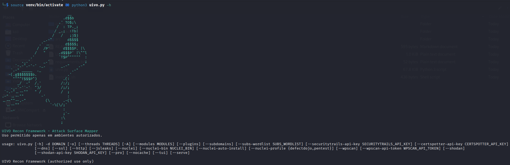
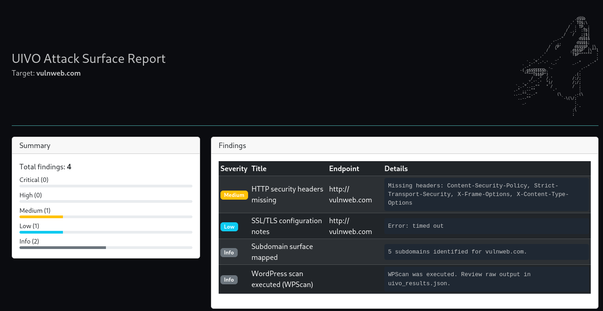

# UIVO – Attack Surface & Recon Framework

**UIVO** é um framework avançado para mapeamento de superfície de ataque, automação de recon e varreduras de segurança.  
Ele combina subdomain enumeration, DNS/SSL/HTTP fingerprinting, Shodan, WPScan, Nuclei e análise de JavaScript para detecção de chaves expostas.



## Funcionalidades

- **Modo Interativo GUIADO**
  Interface via terminal que conduz o usuário passo a passo:
  - Domínio alvo
  - Seleção de módulos
  - Perfis Nuclei (Pentest / DefectDojo)
  - Wordlists
  - Chaves de API (Shodan, SecurityTrails, CertSpotter, WPScan)
  - Geração de relatórios

- **Módulos Integrados**
  1. **Subdomínios** (crt.sh, APIs opcionais, brute-force)
  2. **DNS Recon**
  3. **SSL/TLS Analysis**
  4. **HTTP Fingerprinting**
  5. **Nuclei Scan** (com dois perfis: Pentest e DefectDojo)
  6. **WPScan** (WordPress)
  7. **Shodan** lookup
  8. **JSLeaks** — análise de arquivos .js para detectar:
     - API keys
     - Tokens JWT
     - Keys AWS/GCP/Azure
     - Segredos expostos

- **Relatórios**

  
  - Relatório HTML interativo
  - JSON detalhado de todos os módulos
  - Arquivo compatível com DefectDojo

## Estrutura do Projeto

```
uivo/
│
├── uivo.py                 # Orquestrador principal
│
├── core/                   # Plugins de coleta/análise e módulos internos
│   ├── plugins_subdomains.py
│   ├── plugins_dns.py
│   ├── plugins_ssl.py
│   ├── plugins_http.py
│   ├── plugins_nuclei.py
│   ├── plugins_wpscan.py
│   ├── plugins_shodan.py
│   ├── caching.py
│   ├── reporting.py
│   └── ...
│
├── src/                    # Arquivos complementares / utilidades
│   └── (...)
│
├── venv/                   # Ambiente virtual
│
├── example.com/            # Exemplo real de execução
│
├── README.md
├── LICENSE
├── lista.txt               # Lista de testes
├── requirements.txt
└── installer.sh            # Instalador automático
```

## Modo de Uso

1. Execute:
   ```
   python3 uivo.py
   ```
2. Preencha o domínio alvo.
3. Escolha os módulos desejados.
4. Informe wordlists e chaves API caso queira resultados mais completos.
5. Aguarde o processamento.
6. Abra o relatório HTML gerado no diretório correspondente ao alvo.

## Instalação

### A) Instalação Automática

```
chmod +x installer.sh
./installer.sh
```

Após isso:

```
source venv/bin/activate
python3 uivo.py
```

### B) Instalação Manual

```
git clone https://github.com/SEU-REPO/uivo.git
cd uivo

python3 -m venv venv
source venv/bin/activate

pip install -r requirements.txt
python3 uivo.py
```

## Integração com DefectDojo

UIVO gera automaticamente o arquivo:

```
uivo_findings_defectdojo.json
```

Use em:

**DefectDojo → Engagement → Import Scan Results → Generic JSON**

## Aviso Legal

O uso deste framework é permitido **apenas em ambientes onde você possui autorização explícita**.  
O autor e colaboradores não se responsabilizam por uso indevido.

## Licença

Distribuído sob licença **MIT**.
